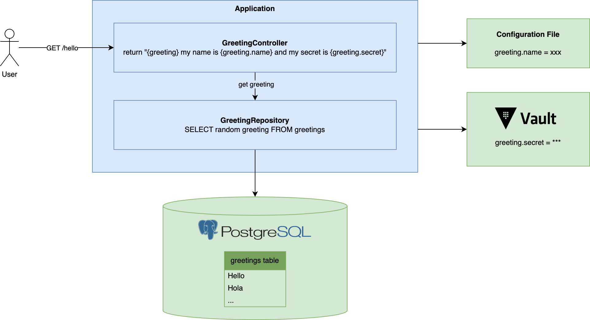

# Top 5 Server-Side Frameworks for Kotlin in 2022

This is a demo inspired by [Anton Arhipov](https://twitter.com/antonarhipov)'s [Top 5 Server-Side Frameworks for Kotlin in 2022 @ Kotlin by JetBrains](https://www.youtube.com/watch?v=pYK5KkuZ3aU) where, spoiler alert, the author shows this top 5 list:

1. [Spring Boot](https://spring.io/projects/spring-boot)
2. [Quarkus](https://quarkus.io/)
3. [Micronaut](https://micronaut.io/)
4. [Ktor](https://ktor.io/docs/welcome.html)
5. [http4k](https://www.http4k.org/)

I have a lot of experience in Spring Boot, so I wanted to take a look at the other ones.

To do so we will create a simple application with each one of these frameworks, implementing the following scenario:



We will use this [docker-compose.yaml](docker-compose.yaml) to start [vault](https://www.vaultproject.io/) and [postgresql](https://www.postgresql.org/). In order to put a `greeting.secret` in vault we will start another vault container overriding its entrypoint to just put the secret using vault-cli and die afterwards (maybe there is another more elegant way to do it but this one works).

## Spring Boot

Quick start with [Spring Initialzr](https://start.spring.io/#!type=gradle-project-kotlin&language=kotlin&platformVersion=2.7.6&packaging=jar&jvmVersion=17&groupId=org.rogervinas&artifactId=springboot-app&name=springboot-app&description=Demo%20project%20for%20Spring%20Boot&packageName=org.rogervinas.springboot-app&dependencies=webflux,cloud-starter-vault-config,jdbc)

Documentation at https://spring.io/projects/spring-boot

### YAML Configuration

By default Spring Boot template is created using an `application.properties` file, but we can rename it to `application.yaml` and it will work the same. We can put there our first configuration property:
```yaml
greeting:
  name: "Bitelchus"
```

More about profiles at https://docs.spring.io/spring-boot/docs/current/reference/html/features.html#features.external-config and https://docs.spring.io/spring-boot/docs/current/reference/html/features.html#features.profiles

### GreetingRepository

We just add the dependencies:
```
org.springframework.boot:spring-boot-starter-jdbc
org.postgresql:postgresql:42.5.1
org.flywaydb:flyway-core:9.8.3
```

and the following configuration in `application.yaml`:
```yaml
spring:
  datasource:
    url: "jdbc:postgresql://${DB_HOST:localhost}:5432/mydb"
    username: "myuser"
    password: "mypassword"
    driver-class-name: "org.postgresql.Driver"
  flyway:
    enabled: true
```

and the flyway migrations under `src/main/resources/db/migrations`.

Then we can implement `GreetingRepository` as:
```kotlin
@Repository
class GreetingRepository(private val jdbcTemplate: JdbcTemplate) {
  fun getGreeting() = jdbcTemplate
    .queryForObject("SELECT greeting FROM greetings ORDER BY random() limit 1", String::class.java)
}
```

* The `@Repository` annotation will tell Spring Boot to create an instance on startup.
* We inject a `JdbcTemplate` (provided by the spring-boot-starter-jdbc autoconfiguration) to execute queries to the database.
* We use `queryForObject` and that SQL to retrieve one random `greeting` from the `greetings` table.

### GreetingController

```kotlin
@RestController
@RequestMapping("/hello")
class GreetingController(
  private val repository: GreetingRepository, 
  @Value("\${greeting.name}") private val name: String,
  @Value("\${greeting.secret:unknown}") private val secret: String
) {
  @GetMapping(produces = [MediaType.TEXT_PLAIN_VALUE])
  fun hello() = "${repository.getGreeting()} my name is $name and my secret is $secret"
}
```

* `@RestController` annotation will tell Spring Boot to create an instance on startup and wire it properly as a REST endpoint on `/hello` path, inspecting its annotated methods.
* `@GetMapping` will map `hello` function on `GET /hello`.
* The controller expects a GreetingRepository to be injected as well as two configuration properties, no matter what property source they come from (environment variables, system properties, configuration files, vault, ...)
* We expect to get `greeting.secret` from vault, that is why we configure `unknown` as its default value, so it does not fail until we configure vault properly.

### GreetingApplication

We need to create a main application:
```kotlin
@SpringBootApplication
class GreetingApplication

fun main(args: Array<String>) { 
  runApplication<GreetingApplication>(*args)
}
```

By convention, all classes under the same package of the main application will be scanned for annotations.

### Vault Configuration

We just add the dependency `org.springframework.cloud:spring-cloud-starter-vault-config` and we add the following configuration in `application.yaml`:
```yaml
spring:
  cloud:
    vault:
      enabled: true
      uri: "http://${VAULT_HOST:localhost}:8200"
      authentication: "TOKEN"
      token: "mytoken"
      kv:
        enabled: true
        backend: "secret"
        default-context: "myapp"
        application-name: "myapp"
  config:
    import: optional:vault://
```

Then we can access the property as `greeting.secret` stored in vault.

### Testing the controller

We can test the controller with a "slice test", meaning only the parts needed by the controller will be started:
```kotlin
@WebFluxTest
@TestPropertySource(properties = [
  "greeting.secret=apple"
])
class GreetingControllerTest {

  @MockBean
  private lateinit var repository: GreetingRepository

  @Autowired
  private lateinit var client: WebTestClient

  @Test
  fun `should say hello`() {
    doReturn("Hello").`when`(repository).getGreeting()

    client
      .get().uri("/hello")
      .exchange()
      .expectStatus().isOk
      .expectBody<String>().isEqualTo("Hello my name is Bitelchus and my secret is apple")
    }
}
```

* We use `WebTestClient` to execute requests to the controller.
* We mock the `GreetingRepository`
* We can use a `@TestPropertySource` to configure the `greeting.secret` property, as in this test we do not have vault.

### Testing the application

To test the whole application we will use Testcontainers and the docker compose file.

```kotlin
@SpringBootTest(webEnvironment = RANDOM_PORT)
@Testcontainers
class GreetingApplicationTest {
    
  companion object {
    @Container
	private val container = DockerComposeContainer(File("../docker-compose.yaml"))
	  .withServices("db", "vault", "vault-cli")
	  .withLocalCompose(true)
	  .waitingFor("db", forLogMessage(".*database system is ready to accept connections.*", 1))
	  .waitingFor("vault", forLogMessage(".*Development mode.*", 1))
  }

  @Autowired
  private lateinit var client: WebTestClient

  @Test
  fun `should say hello`() { 
    client
      .get().uri("/hello")
	  .exchange()
      .expectStatus().isOk
	  .expectBody<String>().consumeWith {
        it.responseBody!!.matches(Regex(".+ my name is Bitelchus and my secret is watermelon"))
      }
  }
}
```

* We use the shared docker compose to start three containers.
* We use `WebTestClient` again to test the endpoint.
* As the greeting is random, now we have to match.
* As now we are using vault the secret is `watermelon`.

### Test

```shell
./gradlew test
```

### Run

```shell
# start vault and database
docker compose up -d vault vault-cli db

# start application
./gradlew bootRun

# make requests
curl http://localhost:8080/hello

# stop application with control-c

# stop vault and database
docker compose down
```

### Build a fatjar and run it

```shell
./gradlew bootJar

# start vault and database
docker compose up -d vault vault-cli db

# start application
java -jar build/libs/springboot-app-0.0.1-SNAPSHOT.jar

# make requests
curl http://localhost:8080/hello

# stop application with control-c

# stop vault and database
docker compose down
```

### Build a docker image and run it

```shell
./gradlew bootBuildImage

# start vault and database
docker compose up -d vault vault-cli db

# start application container
docker compose --profile springboot up -d

# make requests
curl http://localhost:8080/hello

# stop all containers
docker compose down
```

## Quarkus

To begin with you can follow the [Quarkus quick start](https://quarkus.io/get-started/), you will see that there is a `quarkus` command line (easily installable via [sdkman](https://sdkman.io/)) to create an app choosing gradle or maven as the build tool. Once the app is created we can use both quarkus command line or gradle/maven.  

More detailed guide to create your first application at https://quarkus.io/guides/getting-started

More guides at https://quarkus.io/guides/

TODO note about configuration files and default profiles
TODO note about "dev services"

To create a simple application with a reactive REST endpoint:
```shell
sdk install quarkus
quarkus create app org.rogervinas:quarkus-app --gradle-kotlin-dsl --extension='kotlin,resteasy-reactive-jackson'
```

TODO explain generated files

A gradle project is created with the following classes:
* src/main/kotlin/org.rogervinas.GreetingResource: the controller
* src/test/kotlin/org.rogervinas.GreetingResourceTest: the application integration test
* src/native-test/kotlin/org.rogervinas.GreetingResourceIT: the application integration test but using the docker image

We will transform these classes to make it look like the Spring Boot ones.

Just run it once to check everything is ok:
```shell
quarkus dev
```

And just make a request to the endpoint:
```shell
curl http://localhost:8080/hello
Hello from RESTEasy Reactive
```

TODO cleanup
* remove src/main/resources/META-INF directory
* remove README.md

### YAML configuration

To use yaml configuration files we need to add this extension:
```shell
quarkus extension add quarkus-config-yaml
```

Rename src/main/resources/application.properties to application.yaml and add our first property:
```yaml
greeting:
  name: "Bitelchus"
```

[Default profiles](https://quarkus.io/guides/config-reference#default-profiles) in quarkus are:
* dev - Activated when in development mode (i.e. quarkus:dev)
* test - Activated when running tests
* prod - The default profile when not running in development or test mode

So we will create a `application-prod.yaml` to put there all the production configuration properties.

### GreetingController

We transform GreetingResource to GreetingController:
```kotlin
@Path("/hello")
class GreetingController(
  private val repository: GreetingRepository,
  @ConfigProperty(name = "greeting.name") private val name: String,
  @ConfigProperty(name = "greeting.secret") private val secret: String
) {
  @GET
  @Produces(MediaType.TEXT_PLAIN)
  fun hello() = "${repository.getGreeting()} my name is $name and my secret is $secret"
}
```

* We can inject dependencies via constructor.
* We can inject configuration properties using `@ConfigProperty` annotation.
* Everything is pretty similar to Spring Boot. Note that it uses standard JAX-RS annotations which is also possible in Spring Boot (but not by default).

### Database configuration

We will use the Reactive SQL Client https://quarkus.io/guides/reactive-sql-clients
```shell
quarkus extension add quarkus-reactive-pg-client
```

And we configure it for dev and test in application.yaml:
```yaml
quarkus:
  datasource:
    devservices:
      image-name: "postgres:14.5"
```

And for production in application-prod.yaml:
```yaml
quarkus:
  datasource:
    db-kind: "postgresql"
    username: "myuser"
    password: "mypassword"
    reactive:
      url: "postgresql://${DB_HOST:localhost}:5432/mydb"
      max-size: 20
```

### Flyway migrations

To enable flyway https://quarkus.io/guides/flyway, add these dependencies manually (no extension?)
```kotlin
implementation("io.quarkus:quarkus-flyway")
implementation("io.quarkus:quarkus-jdbc-postgresql")
```

quarkus extension add jdbc-postgresql ???

We cannot use the same reactive datasource, so we will have to configure the standard one:
```yaml
quarkus:
  flyway:
    migrate-at-start: true
```

```yaml
quarkus:
  datasource:
    db-kind: "postgresql"
    username: "myuser"
    password: "mypassword"
    jdbc:
      url: "jdbc:postgresql://${DB_HOST:localhost}:5432/mydb"
      max-size: 20
    reactive:
      url: "postgresql://${DB_HOST:localhost}:5432/mydb"
      max-size: 20
```

JDBC driver used by flyway, Reactive driver used by our `GreetingRepository`.

And we add the migrations under db/migrations.

```kotlin
@ApplicationScoped
class GreetingRepository(private val client: PgPool) {
  fun getGreeting() = client
    .query("SELECT greeting FROM greetings ORDER BY random() limit 1")
    .executeAndAwait()
    .map { r -> r.get(String::class.java, "greeting") }
    .first()
}
```

* `@ApplicationScoped` annotation https://quarkus.io/guides/cdi
* We inject the reactive client.

### Vault configuration

Following this guide https://quarkiverse.github.io/quarkiverse-docs/quarkus-vault/dev/index.html

Add the extension:
```shell
quarkus extension add vault
```

We configure the dev service in application.yaml:
```yaml
quarkus:
  vault:
    secret-config-kv-path: "myapp"
    devservices:
      image-name: "vault:1.12.1"
      init-commands:
        - "kv put secret/myapp greeting.secret=watermelon"
```

And for production in application-prod.yaml:
```yaml
quarkus:
  vault:
    url: "http://${VAULT_HOST:localhost}:8200"
    authentication:
      client-token: "mytoken"
```

## Optional: native image

Packaging https://quarkus.io/guides/building-native-image + https://quarkus.io/guides/building-native-image#testing-the-native-executable

https://quarkus.io/guides/building-native-image
sdk install java 22.3.r19-grl
gu install native-image
quarkus build --native -Dquarkus.native.container-build=true
https://quarkus.io/guides/building-native-image#multistage-docker

docker build -f src/main/docker/Dockerfile.native -t quarkus-app . ?

## Testing the controller

```kotlin
@QuarkusTest
@TestHTTPEndpoint(GreetingController::class)
class GreetingControllerTest {
    
  @InjectMock
  private lateinit var repository: GreetingRepository

  @Test
  fun `should say hello`() {
    doReturn("Hello").`when`(repository).getGreeting()

    `when`()
      .get()
      .then()
      .statusCode(200)
      .body(`is`("Hello my name is Bitelchus and my secret is watermelon"))
    }
}
```

* `@QuarkusTest` will start all devservices, that we are not using.
* `@InjectMock` to mock the repository.
* RestAssured to test the endpoint.

## Testing the application

```kotlin
@QuarkusTest
class GreetingApplicationTest {
    
  @Test
  fun `should say hello`() {
    given()
      .`when`().get("/hello")
      .then()
      .statusCode(200)
      .body(matchesPattern(".+ my name is Bitelchus and my secret is watermelon"))
    }
}
```

### Test

```shell
./gradlew test
```

### Run in dev

```shell
# start application with dev services
quarkus dev

# make requests
curl http://localhost:8080/hello
```

### Build a fatjar and run it

```shell
quarkus build

# start vault and database
docker compose up -d vault vault-cli db

# start application
java -jar build/quarkus-app/quarkus-run.jar

# make requests
curl http://localhost:8080/hello

# stop application with control-c

# stop vault and database
docker compose down
```

### Build a docker image and run it

```shell
quarkus build
docker build -f src/main/docker/Dockerfile.jvm -t quarkus-app . 

# start vault and database
docker compose up -d vault vault-cli db

# start application container
docker compose --profile quarkus up -d

# make requests
curl http://localhost:8080/hello

# stop all containers
docker compose --profile quarkus down
docker compose down
```
