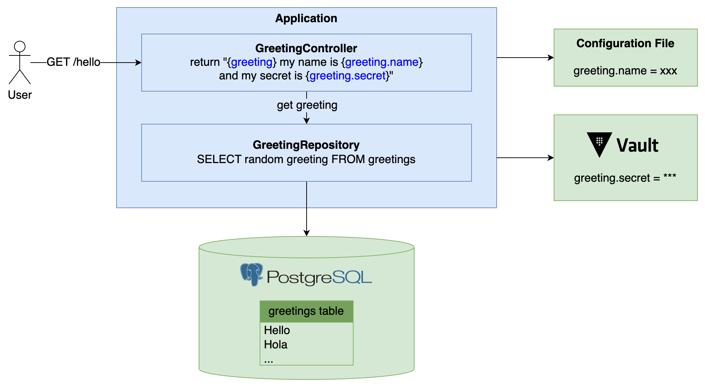

# Top 5 Server-Side Frameworks for Kotlin in 2022

This is a demo inspired by [Anton Arhipov](https://github.com/antonarhipov)'s [Top 5 Server-Side Frameworks for Kotlin in 2022 @ Kotlin by JetBrains](https://www.youtube.com/watch?v=pYK5KkuZ3aU) where, **spoiler alert**, the author shares this top 5 list:

🥇 [Spring Boot](https://spring.io/projects/spring-boot)
🥈 [Quarkus](https://quarkus.io/)
🥉 [Micronaut](https://micronaut.io/)
🏅 [Ktor](https://ktor.io/docs/welcome.html)
🏅 [http4k](https://www.http4k.org/)

I have a lot of experience in **Spring Boot**, so I wanted to take a look at the other ones 😜

  

To do so we will create a simple application with each one of these frameworks, implementing the following scenario:

  

We will use this [docker-compose.yaml](docker-compose.yaml) to start locally [Vault](https://www.vaultproject.io/) and [Postgresql](https://www.postgresql.org/), as well as the application containers.

In order to put a `greeting.secret` in vault we will start another **Vault** container overriding its entrypoint to just put the secret using `vault kv put` and die afterwards (maybe there is another more elegant way to do it but this one works).

Please find below a step-by-step guide for each one of the top 5 frameworks. Here we go!

1. [Spring Boot](springboot-app)
2. [Quarkus](quarkus-app)
3. [Micronaut](micronaut-app)
4. Ktor - coming soon!
5. http4k - coming soon!

Happy coding! 💙
